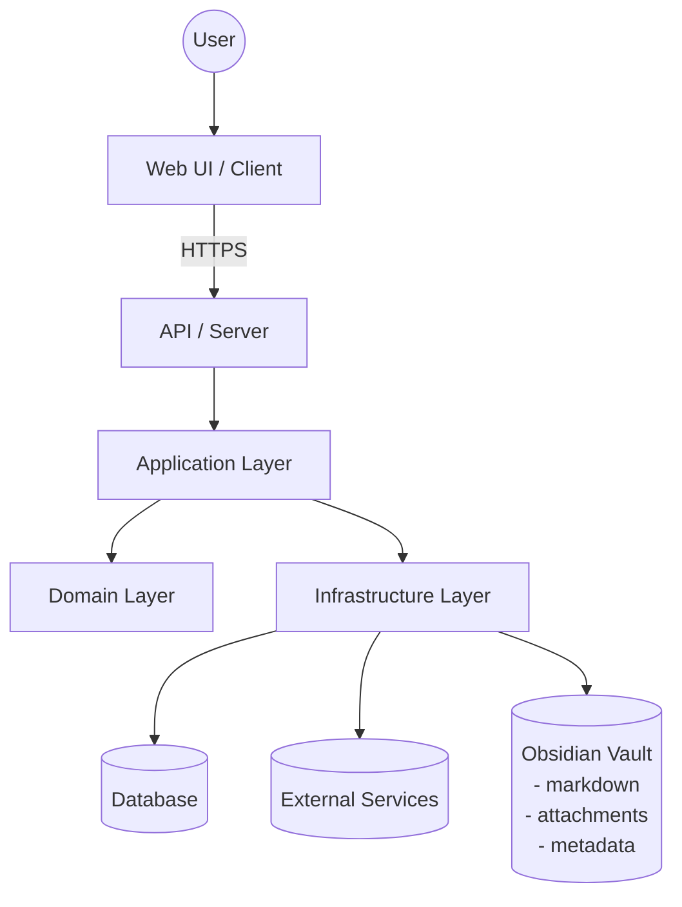

# Architecture

> **Repository:** `Maxi-flores/Sapient-DF`  
> **Type:** Full-stack (Web UI + API)  
> **Obsidian integration:** Uses an Obsidian vault as a reference/knowledge source  
> **Last updated:** 2026-04-24

## 1. Overview
Sapient-DF is a **TypeScript-first full-stack** application. It includes:
- a **frontend** (UI/client) responsible for user interactions
- a **backend** (API/server) responsible for business logic, data access, and integrations
- an **Obsidian vault reference** used as a knowledge base/content source for features like notes, documents, or context retrieval

This document describes the intended architecture, module boundaries, and the main request/data flows.

**Primary goals**
- Clear separation of concerns (UI vs API vs domain/infrastructure).
- Predictable dependency direction (edges depend inward).
- Safe handling of vault content (paths, links, and metadata) without leaking sensitive data.
- Easy local development, testing, and deployment.

## 2. High-level structure
A typical full-stack layout for this repo is:
- **Client/UI**: pages/components, client-side state, API calls.
- **Server/API**: routes/controllers, auth, request validation.
- **Application layer**: use-cases and orchestration (commands/queries).
- **Domain layer**: core business rules and types.
- **Infrastructure layer**: persistence, external services, filesystem/vault adapters.
- **Shared**: types/utilities used by both client and server.

> Treat the frontend and backend as **separately deployable** units, even if they live in one repo.

## 3. Component diagram

## 4. Dependency direction (rules)
Dependencies should generally flow **inward**:
- UI/Presentation → Server/API → Application → Domain
- Infrastructure depends on Domain types/contracts (not the other way around).

**Practical rules**
- Keep I/O at the edges: DB access, HTTP clients, and vault filesystem access live in Infrastructure.
- Domain should stay framework-agnostic.
- Prefer interfaces/ports defined in Application/Domain and implemented in Infrastructure (ports & adapters).

## 5. Key flows

### 5.1 Typical API request flow
1. **Route/handler**: authentication + input validation.
2. **Application**: constructs a command/query and orchestrates.
3. **Domain**: enforces business rules.
4. **Infrastructure**: reads/writes DB, calls external APIs, reads from vault.
5. **Response mapping**: returns DTOs suitable for the UI.

### 5.2 Obsidian vault reference flow (read-only by default)
Common flow for “vault-backed” features (search, preview, linking, context retrieval):
1. API receives a request (e.g., `GET /vault/note/:id`, `GET /vault/search?q=...`).
2. Application calls a **VaultService** (port/interface).
3. Infrastructure **VaultAdapter** accesses the vault:
   - reads Markdown files
   - parses frontmatter/metadata
   - resolves internal links (e.g., `[[Wiki Links]]`) and attachments
4. API returns a sanitized representation:
   - Markdown (raw or rendered)
   - extracted metadata
   - a safe list of resolved links

**Security & safety constraints (recommended)**
- Treat the vault as **untrusted input**.
- Enforce an allowlist of readable paths and file extensions.
- Prevent path traversal (`..`, absolute paths).
- Consider read-only access in production unless explicitly required.

## 6. Data model and state
- Prefer shared TypeScript types for DTOs and domain models.
- Validate at boundaries (requests, env vars, vault metadata/frontmatter).

If there is a database:
- Keep schema/migrations in a dedicated folder.
- Treat migrations as part of the release artifact.

## 7. Configuration & secrets
- Configuration should come from environment variables (or a single config module).
- Validate config at startup (fail fast).
- Never commit secrets.

For vault integration, define:
- `VAULT_ROOT` (absolute/relative path)
- optional: `VAULT_READONLY=true`
- optional: allowed extensions (e.g., `.md`, images)

## 8. Observability
Minimum recommended setup:
- Structured logging (JSON in production)
- Request correlation IDs
- Metrics (latency, error rate)
- Error tracking

For vault features, log:
- time spent reading/parsing
- cache hit/miss (if caching is used)
- rejected path attempts (security signal)

## 9. Testing strategy
- **Unit tests**: domain/application logic.
- **Integration tests**: DB + vault adapter (use fixture vault content).
- **E2E tests**: UI ↔ API ↔ vault flows.

## 10. Deployment
Document how the app is built and deployed:
- Build artifacts (e.g., `dist/`, static assets, container image)
- Environments (dev/staging/prod)
- CI pipelines and release process

Vault in deployment:
- Either ship the vault content with the deployment artifact, or mount it as a volume.
- Ensure the runtime has correct read permissions and path configuration.

## 11. Repository conventions
- Use path aliases to avoid deep relative imports.
- Keep shared types in a clearly named module.
- Keep operational scripts under `scripts/`.

## 12. Architecture decision records (ADRs)
When making non-trivial decisions, record them:
- Create `docs/adr/NNNN-title.md`.
- Keep decisions small and time-stamped.
