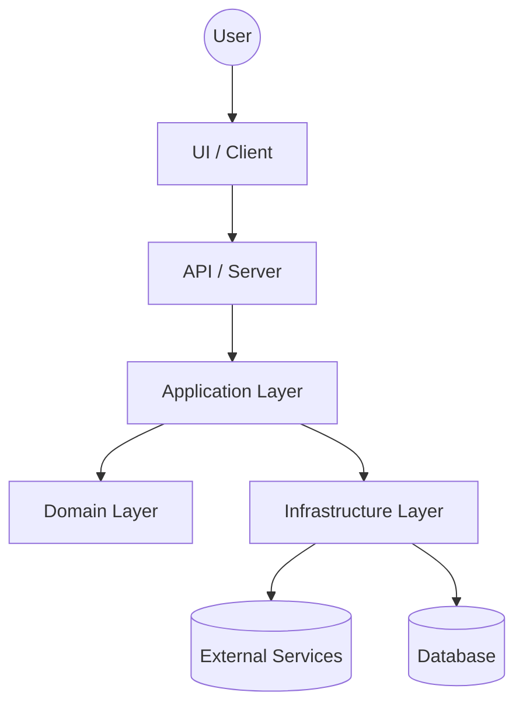

# Architecture

> **Repository:** `Maxi-flores/Sapient-DF`  
> **Last updated:** 2026-04-24

## 1. Overview
Sapient-DF is a TypeScript-first codebase (with a small amount of Shell/CSS/JS) organized as a typical modern web/service project. This document captures the system’s high-level structure, the responsibilities of major components, and the conventions used to keep the code maintainable.

**Primary goals**
- Clear separation of concerns (domain vs. infrastructure vs. presentation).
- Predictable module boundaries and dependency direction.
- Easy local development, testing, and deployment.

## 2. High-level structure
At a high level, the repository is expected to contain:
- **Application layer**: request/command handling, orchestration, use-cases.
- **Domain layer**: core business rules (pure TypeScript where possible).
- **Infrastructure layer**: external integrations (DB, APIs, queues, file storage).
- **Presentation / Interface layer**: HTTP handlers, UI, CLI, or other entrypoints.

> If the repo contains both a frontend and backend, treat them as separate deployable units that share types/utilities via a dedicated shared package/folder.

## 3. Component diagram

## 4. Dependency direction (rules)
To keep the architecture stable, dependencies should generally flow **inward**:
- Presentation → Application → Domain
- Infrastructure may depend on Domain types, but Domain should not depend on Infrastructure.

**Practical rules**
- Domain code should avoid importing from framework-specific modules.
- Infrastructure adapters implement interfaces defined closer to the domain/application.
- Keep side effects (I/O, network, filesystem) at the edges.

## 5. Typical request/data flow
A typical HTTP/API request (or UI interaction) should follow this sequence:
1. **Entry point**: route/controller/handler validates basic shape.
2. **Application**: maps input to a command/query and orchestrates.
3. **Domain**: executes business rules and returns domain results.
4. **Infrastructure**: persists/fetches data or calls external services.
5. **Presentation**: maps domain results to API response or UI state.

## 6. Data model and state
Because the repo is primarily TypeScript, prefer:
- Shared **types** for DTOs and domain models.
- Narrow, explicit interfaces for repositories/services.
- Validation at boundaries (e.g., request payloads, env vars).

If there is a database:
- Keep schema/migrations in a dedicated folder.
- Treat migrations as part of the release artifact.

## 7. Configuration & secrets
- Configuration should come from environment variables or a single config module.
- Validate config at startup (fail fast).
- Never commit secrets; use `.env` locally and secret stores in CI/CD.

## 8. Observability
Minimum recommended setup:
- Structured logging (JSON logs in production).
- Request correlation IDs.
- Basic metrics (latency, error rate) and error tracking.

## 9. Testing strategy
- **Unit tests**: domain/application logic.
- **Integration tests**: infrastructure adapters (DB, HTTP clients).
- **E2E tests** (if applicable): API routes or UI flows.

## 10. Deployment
Document how the app is built and deployed:
- Build artifacts (e.g., `dist/`, container image).
- Environments (dev/staging/prod).
- Release process (CI pipelines, approvals).

## 11. Repository conventions
Recommended conventions:
- Use path aliases (where appropriate) to avoid deep relative imports.
- Consistent lint/format rules.
- Keep scripts in `package.json` and operational scripts under a `scripts/` folder.

## 12. Architecture decision records (ADRs)
When making non-trivial decisions (framework, database, major refactors), record them:
- Create `docs/adr/NNNN-title.md`.
- Keep decisions small and time-stamped.

---

### Next steps (optional)
If you want, I can tailor this document to your *actual* structure by scanning the repo for:
- entrypoints (e.g., `src/index.ts`, `apps/*`)
- routing/controllers
- DB/migrations
- CI workflows
- deploy manifests

…and then update this file with the real modules and flows.
